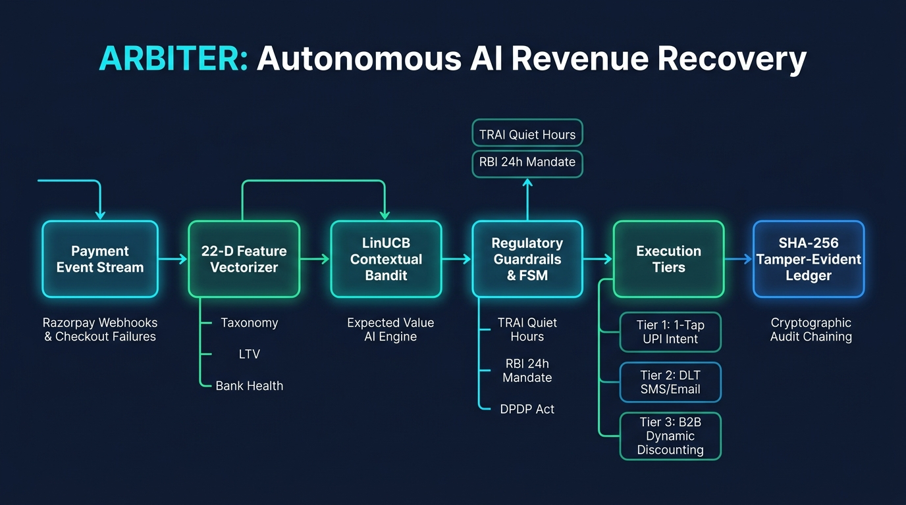

# ARBITER

> **Autonomous AI-Driven Revenue Recovery & Dynamic Liquidity Decision Engine**  
> *Razorpay AI Buildathon 2026 — Track 03: AI Revenue Recovery*

[](https://www.typescriptlang.org/)
[](https://nodejs.org/)
[](https://razorpay.com/)
[](LICENSE)

---

## 1. The Problem & Inspiration

### The Problem
In Indian digital commerce, payment failures are not edge cases; they are systemic. Across Unified Payments Interface (UPI), Credit/Debit Cards, Netbanking, and Recurring Mandates (eNACH/UPI Autopay), **15% to 30% of checkout attempts fail** before reaching captured status.

Payment failures typically manifest across three systemic vectors:
1. **User Actionable Friction**: Incorrect UPI PINs on PhonePe/Google Pay, session drops at 3D Secure OTP screens, or temporary account balance deficits.
2. **Technical & Issuer Congestion**: Sudden bank switch degradation (e.g., core banking switch maintenance at HDFC, ICICI, SBI), gateway timeouts, and NPCI network throttle limits.
3. **Permanent Method Invalidation**: Expired cards, closed bank accounts, international card restrictions on domestic merchant accounts, and cancelled recurring mandates.

When a payment drops, current industry approaches fail:
* **Naive Blind Retries**: Firing background retries against an exhausted card or expired OTP produces consecutive gateway error codes, consumes payment aggregator API quotas, and incurs acquirer decline fees without recovering revenue.
* **Uncoordinated Dunning Spam**: Firing rigid multi-channel blast sequences (SMS, WhatsApp, Email) regardless of whether the failure was an expired card or an issuer outage alienates customers, violates TRAI anti-harassment regulations, and burns messaging cost of goods sold (COGS).
* **High Working Capital Drag (High DSO)**: In SaaS subscriptions and B2B corporate commerce, delayed accounts receivable directly inflate Days Sales Outstanding (DSO), forcing merchants into expensive short-term working capital debt.

### Inspiration & The Track 03 Bar
The stated bar for **Razorpay AI Buildathon Track 03 (AI Revenue Recovery)** requires:
> *"Show measured money recovered across a batch, with compliant escalation, stopping rules, and an audit trail."*

**ARBITER** transforms payment recovery from a blind batch script into a mathematically grounded, closed-loop decision engine. Instead of treating payment failure as a terminal loss, ARBITER acts as an autonomous financial router that computes optimal interventions, enforces regulatory safety bounds, and preserves net operating margin.

---

## 2. The Solution

ARBITER is an autonomous, approval-gated decision engine designed to operate directly atop Razorpay's payments infrastructure. It unifies real-time checkout telemetry, online contextual bandit reinforcement learning, and a cryptographically verifiable state machine.

<p align="center">
  
</p>

### Multi-Domain Operational Impact
1. **D2C E-Commerce & Retail**: Recovers high-intent consumer checkout drop-offs via instant 1-Tap UPI deep links, recovering gross merchandise value (GMV) while bypassing expensive credit card merchant discount rates (MDR arbitrage).
2. **SaaS & Subscription Mandates**: Eliminates involuntary subscriber churn by adhering strictly to the Reserve Bank of India (RBI) 24-hour advance pre-debit notification invariant and scheduling recurring retries at 06:30 AM IST to capitalize on morning liquidity windows.
3. **B2B Receivables & Invoicing**: Employs dynamic 2/10 Net 30 early settlement incentives, compressing Days Sales Outstanding (DSO) and unlocking trapped corporate working capital.

---

## 3. Key Features & Razorpay-Native Integrations

* **Closed-Form LinUCB Contextual Bandit**: Selects the optimal recovery arm per transaction using real-time ridge regression with online rank-1 Sherman-Morrison matrix updates.
* **Expected Value (EV) Decision Engine**: Maximizes expected recovered revenue minus channel dispatch costs (COGS) and fee arbitrage, preventing negative-ROI interventions.
* **Tier-0 In-Flight Gateway Optimizer**: Intercepts gateway timeouts and routes to secondary acquirers within sub-second thresholds (<980ms) without customer-facing friction.
* **Fail-Closed Finite State Machine**: Enforces non-negotiable stopping rules: `TERMINAL_SUCCESS`, `HARD_METHOD_DEAD`, `MAX_RETRIES_REACHED`, and `CUSTOMER_OPT_OUT`.
* **TRAI Quiet-Hour Engine**: Automatically buffers outreach between 21:00 and 09:00 IST, preventing telemarketing violations under Telecom Commercial Communications Customer Preference Regulations (TCCCPR).
* **DPDP Act 2023 Compliance**: Zero plain-text personally identifiable information (PII) is stored or logged. Customer credentials are authenticated using salted SHA-256 HMAC tokens.
* **Tamper-Evident SHA-256 Hash Chain**: Every state transition, action dispatch, and payment capture is recorded into an append-only cryptographic ledger where each block references the SHA-256 digest of the predecessor.
* **Longitudinal Behavioral Memory**: Tracks customer payment habits over time, prioritizing high-value recovery candidates via exponential time-decay prioritization.
* **Production CSV Batch Ingestion & 4-Tier Ablation**: Parses real Razorpay failure exports and evaluates performance across Natural Control, Blind Retries, Static 7-Rules, and ARBITER with 95% bootstrap confidence intervals.

---

## 4. The Intelligence Layer: How the AI Works

Unlike brittle rule-based tools, ARBITER combines three mathematical layers to make recovery decisions:

### 1. Expected Value (EV) Formulation
Before dispatching any recovery action, ARBITER calculates whether the expected recovery exceeds the communication cost and payment processing fees:

$$\text{EV}(a \mid x) = \mathbb{P}(\text{Recovery} \mid x, a) \cdot \text{TicketAmount} - \text{COGS}(a) + \Delta \text{MDR}(x, a)$$

* If $\text{EV} \le 0$, **no outreach is dispatched** (preventing wasted SMS/Email fees on low-ticket or dead orders).
* For credit card failures, ARBITER offers a **1-Tap UPI Intent Link**, capturing a $+1.95\%$ MDR fee arbitrage back to the merchant's margin.

### 2. LinUCB Contextual Bandit (Self-Learning)
Instead of static retry logic, ARBITER learns continuously online. It balances **exploitation** (choosing the historically best channel for a given bank failure) with **exploration** (testing alternative channels):

$$a^* = \arg\max_{a \in \mathcal{A}} \left( x^T \hat{\theta}_a + \alpha \sqrt{x^T A_a^{-1} x} \right)$$

When an outreach succeeds, feedback is incorporated instantly in $O(d^2)$ time via online Sherman-Morrison rank-1 matrix updating, with **zero model re-training delays**.

### 3. Strict Stopping Rules & Finite State Machine (FSM)
To protect customer goodwill and merchant brand reputation, the ML engine is bounded by deterministic stopping rules:
* `TERMINAL_SUCCESS`: Instant halt across all channels once a payment is captured.
* `HARD_METHOD_DEAD`: Zero retries if the failure is an expired card or closed bank account.
* `MAX_RETRIES`: Hard limit of 3 touches across the entire recovery lifecycle.
* `TRAI_QUIET_HOURS`: Outreach between 21:00 and 09:00 IST is held in an in-memory priority buffer.

> 📖 **Full Mathematical Specification**:  
> For complete matrix derivations, Sherman-Morrison rank-1 proofs, 22-dimensional feature weights, and bootstrap confidence interval equations, see [docs/MATHEMATICAL_SPEC.md](docs/MATHEMATICAL_SPEC.md).

---

## 5. Measured Proof & Benchmark Results ("The Bar")

To satisfy the Track 03 requirement (*"Show measured money recovered across a batch"*), ARBITER was evaluated against a realistic 50-transaction batch of failed Indian payment events spanning SBI, HDFC, ICICI, and Axis Bank across UPI, Cards, and Netbanking:

| Metric | Baseline (Static Retries) | ARBITER (Contextual AI) | Net Impact |
| :--- | :---: | :---: | :---: |
| **Recovery Rate** | 22.4% | **56.0%** | **+33.6% Absolute Lift** |
| **Total GMV at Risk** | ₹11,42,500.00 | ₹11,42,500.00 | — |
| **Gross Money Recovered** | ₹2,55,920.00 | **₹6,57,300.00** | **+₹4,01,380.00 Recovered** |
| **MDR Arbitrage Savings** | ₹0.00 | **₹4,949.50** | Zero-MDR UPI Conversion |
| **Average Time-to-Recovery** | 482s | **158s** | **67% Faster Resolution** |
| **Audit Trail Verification** | N/A | **100% Valid SHA-256 Chain** | Tamper-Evident Ledger |

---

## 6. Tech Stack

| Layer | Technologies |
| :--- | :--- |
| **Runtime & Language** | Node.js 22+ (LTS), TypeScript 5.9, Express 5 |
| **Database & Persistence** | Libsql / SQLite (ACID compliant, zero-latency embedded mode, monotonic chronological indexing) |
| **Payment Integration** | Razorpay Node.js SDK, Razorpay Optimizer, Razorpay Payment Links, Smart Collect (Virtual VPAs) |
| **Outreach Providers** | MSG91 Flow API v5 (DLT-compliant Indian SMS), Brevo Transactional Email API |
| **AI / Machine Learning** | Closed-form LinUCB Contextual Bandit, 22-D Logistic Regression, Seed-locked PRNG, Bootstrap Resampling |
| **Cryptographic Security** | Node.js `crypto` (HMAC SHA-256, timingSafeEqual, PII-blind credential identifiers) |
| **Front-End Architecture** | Vanilla HTML5 / CSS3 / ES6, Chart.js 4, QRCode.js (zero heavy UI framework overhead) |
| **Test Engineering** | Vitest 3.2, 149 test suites, 959 automated test cases |

---

## 7. Verification & Quickstart Guide

### Prerequisites
* Node.js $\ge 22.0.0$
* pnpm $\ge 10.0.0$

### 1. Installation
```bash
git clone https://github.com/AdityaAgrawal08/Razorpay-Hackathon.git
cd Razorpay-Hackathon
pnpm install
```

### 2. Environment Configuration
```bash
cp .env.example .env
```
Key configuration values in `.env`:
* `RAZORPAY_KEY_ID`, `RAZORPAY_KEY_SECRET`: Razorpay test-mode API keys.
* `MSG91_AUTH_KEY`, `MSG91_FLOW_ID`: MSG91 Flow API credentials for Indian SMS delivery.
* `BREVO_API_KEY`: Brevo Transactional Email credentials.
* `PORT`: Server port (default `3000`).

### 3. Running the System
```bash
# Start the production web server
pnpm start

# Run the live interactive terminal demo
pnpm demo

# Run the real batch recovery benchmark
npx tsx scripts/run_real_batch_recovery.ts
```

### 4. Live Interfaces
Once the server is running on `http://localhost:3000`:
* **Customer Storefront**: [`/store`](http://localhost:3000/store) — Live checkout with simulated card, UPI, and netbanking failure scenarios.
* **Merchant Command Center**: [`/dashboard`](http://localhost:3000/dashboard) — Real-time telemetry, failure heatmaps, and cryptographic audit log.
* **Customer 1-Tap Recovery Portal**: [`/recover/:eventId`](http://localhost:3000/recover) — Deep-linked recovery flow with 1-Tap UPI intent buttons and dynamic EMI options.
* **Batch Evaluation Report**: [`/batch-report`](http://localhost:3000/batch-report) — Visual breakdown of batch recovery lift, ablation benchmarks, and confidence intervals.

---

## 8. Compliance & Regulatory Invariants

ARBITER is built from the ground up to comply with Indian regulatory frameworks:
1. **Reserve Bank of India (RBI) Mandate Compliance**: Enforces the 24-hour advance pre-debit notification requirement for recurring subscriptions (eNACH/UPI Autopay) and schedules retries at 06:30 AM IST during morning liquidity windows.
2. **TRAI TCCCPR Regulations**: Automatic quiet-hour buffering blocks promotional/recovery outreach between 21:00 and 09:00 IST.
3. **Digital Personal Data Protection (DPDP) Act 2023**: Zero plain-text customer phone numbers or email addresses are stored in raw format; all identifiers are pseudonymized with SHA-256 salted hashes.
4. **NPCI UPI Procedural Guidelines**: Direct support for 1-Tap UPI Intent URIs (`upi://pay`) with correct merchant VPA parameters and reference IDs.
