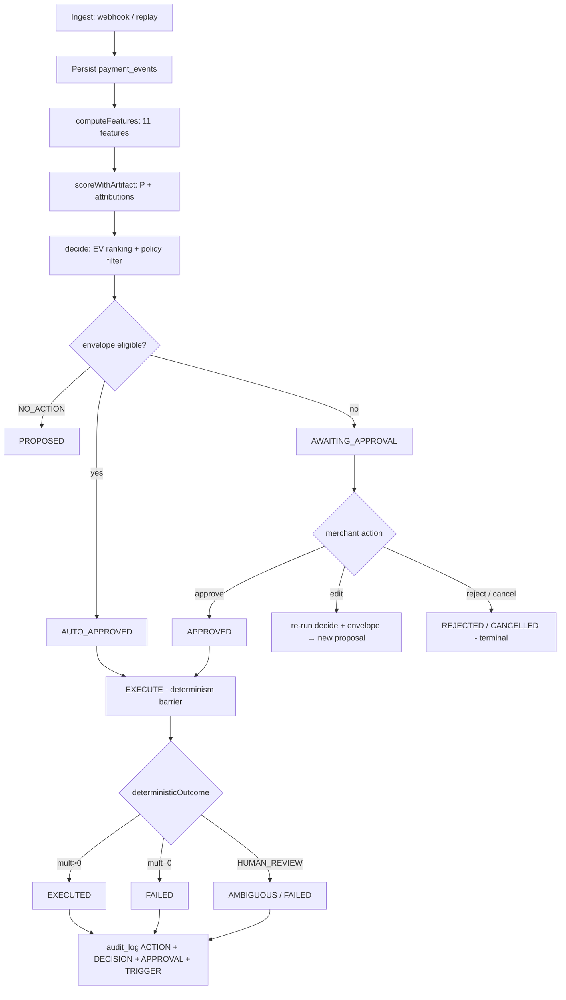
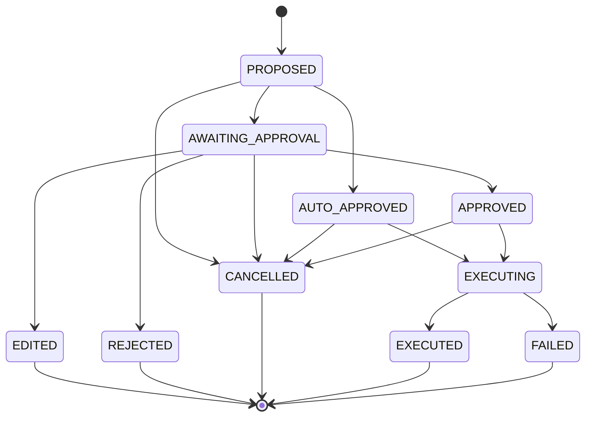

# ARBITER — Approval-Gated Revenue Recovery Decision Engine

### Razorpay AI Buildathon · Track 03: AI Revenue Recovery

> **One line:** ARBITER detects failed recurring payments, predicts recovery likelihood, chooses the highest expected-value intervention within strict policy guardrails, and executes it only after human approval — with every decision provenance-stamped in an append-only audit ledger.

**Live track:** [razorpay.com/buildathon](https://razorpay.com/buildathon/) · Track 03 — *“Find revenue that's slipping away and win it back. Build an agent that detects revenue at risk, determines the right intervention, and executes a bounded recovery workflow.”*

---

## Table of Contents

1. [Problem Statement](#1-problem-statement)
2. [Proposed Solution](#2-proposed-solution)
3. [How It Works](#3-how-it-works)
4. [Razorpay Integration](#4-razorpay-integration)
5. [End-User Workflow](#5-end-user-workflow)
6. [Architecture](#6-architecture)
7. [Agentic AI](#7-agentic-ai)
8. [Key Features](#8-key-features)
9. [Tech Stack](#9-tech-stack)
10. [Setup and Usage](#10-setup-and-usage)
11. [Buildathon Alignment](#11-buildathon-alignment)

---

## 1. Problem Statement

Indian subscription and D2C merchants lose significant recurring revenue to **involuntary churn** — payments that fail silently when the customer still intends to pay. Typical failure modes include insufficient funds around salary cycles, expired cards / revoked mandates, gateway timeouts, and risk blocks.

The current response is binary and inefficient:

* **Do nothing** — revenue is permanently lost.
* **Blind retry** — the same method is retried on a fixed schedule regardless of root cause. This spams customers, triggers issuer penalties, and wastes effort on payment methods that are cryptographically dead (e.g., `MANDATE_REVOKED` never recovers via retry; only an alternate-method link can).

The real problem — and the exact scope of **Track 03: AI Revenue Recovery** — is **triage at scale**: for each failed payment, determine *why* it failed, estimate the probability that each possible intervention will actually recover the money, respect compliance constraints (quiet hours, attempt caps, opt-outs, risk), and execute only the action with the highest expected value that a human has approved. The buildathon bar makes this explicit:

> *“Don't just identify the problem. Show measured money recovered across a batch, with compliant escalation, stopping rules, and an audit trail.”*

ARBITER is scoped deliberately to **payment-failure recovery for recurring/subscription payments** — the track's *Payment degradation → root cause → recovery action*, *Failed-subscription recovery*, *Mandate retry sequencer*, and *Promise-to-pay tracker* directions. Checkout drop-off recovery and B2B receivables chasing are not built in this iteration.

---

## 2. Proposed Solution

ARBITER is a **six-stage closed-loop decision engine**: `PREDICT → DECIDE → PROPOSE → APPROVE → EXECUTE → LEARN`.

| Stage | Responsibility |
|---|---|
| **PREDICT** | Score `P(recovery)` for a failed payment using a calibrated, deterministic logistic-regression model + deterministic feature pipeline |
| **DECIDE** | Compute expected value `EV(action) = P(recovery \| action) × amount − contactCost` for 6 interventions and rank them under a strict policy pack |
| **PROPOSE** | Create a proposal with EV, confidence, attributions, and a Claude-generated case brief (decorative, never on the money path) |
| **APPROVE** | Human-in-the-loop gate: auto-approve only when a versioned **autonomy envelope** explicitly permits the class/channel/amount/attempt; otherwise await merchant approval |
| **EXECUTE** | Once-only, idempotent execution behind a determinism barrier — same proposal + same clock → same outcome |
| **LEARN** | Immutable model registry and measurement harness for batch comparison |

**Why this solves the problem:**

1. **No wasted retries** — an action-conditioned multiplier table (`SOFT_RETRYABLE × RETRY_PAYDAY = 1.4`, `HARD_METHOD_DEAD × RETRY_NOW = 0.0`, etc.) ensures dead-method retries are scored at zero recovery and never chosen.
2. **Bounded authority** — the LLM proposes, the deterministic policy engine disposes. Every money-adjacent action passes a versioned, auditable rule set. Wrong predictions cannot move money alone.
3. **Provenance** — every state transition, envelope evaluation, and execution receipt is written to an append-only `audit_log` with `model_version` + `policy_version` stamps.
4. **Measurable** — a two-arm (CONTROL vs PIPELINE) Monte-Carlo harness replays the identical demo corpus through both arms and reports recovered paise with ranges.

---

## 3. How It Works

### 3.1 Complete Workflow

```
Webhook / Replay → INGEST → PREDICT (features → score) → DECIDE (EV ranking + policy filter)
    → Envelope check → PROPOSE (state: AWAITING_APPROVAL or AUTO_APPROVED)
    → APPROVE (merchant action or envelope auto-approval) → EXECUTE (determinism barrier)
    → audit_log (TRIGGER → DECISION → APPROVAL → ACTION) → Measurement harness (batch comparison)
```

**Step-by-step — actual implementation (`packages/core/src/*`, `packages/ml/src/*`):**

**1. Ingest — detect revenue at risk** (`packages/core/src/ingest/webhook.ts:95`, `packages/core/src/ingest/replay.ts:120`)

* Two entry points share the same `recordFailureEvent()` path:
  * **Webhook**: `processWebhook()` verifies HMAC-SHA256 over the **raw request body** before any JSON parsing (`verifySignature()` at `webhook.ts:56`), deduplicates by `provider_event_id` in `webhook_dedupe`, rejects unsigned/malformed payloads with a `REFUSAL` ledger row (fail-closed), and only ingests `payment.failed` events into `payment_events`.
  * **Replay**: `replayCorpus()` feeds seeded `Corpus` fixtures deterministically for demos and tests. Idempotent on `payment_events.id`.

**2. PREDICT — score recovery probability** (`packages/ml/src/features.ts:126`, `packages/ml/src/predict.ts:32`)

* `computeFeatures()` is a pure, leakage-free function. Inputs are strictly decision-time information: failure code, amount, customer payday histogram (noisy observations of successful debit day-of-month, never ground truth), prior failure amounts, channel responsiveness, tenure.
* 11 features (`FEATURE_NAMES` at `features.ts:16`): 4 class one-hots, `near_payday`, `payday_confidence`, `amount_z` (z-score vs prior failures), `prior_success_norm`, `prior_failure_norm`, `channel_responsiveness`, `tenure_norm`. Missing history → explicit sentinel values, never NaN.
* `scoreWithArtifact()` standardizes with `μ/σ` from the model artifact, computes logit, applies `stableSigmoid`, and returns `probability` plus exact attributions `w_i·x̂_i` (top 5).
* Payday inference (`inferPayday()` at `features.ts:93`): modal day of the success histogram; requires ≥3 observations, otherwise returns `null` confidence.

**3. DECIDE — choose the best intervention** (`packages/core/src/decide/engine.ts:99`, `packages/core/src/decide/catalog.ts:16`)

* Catalog of 6 actions (order is normative for stable tie-break): `RETRY_NOW`, `RETRY_PAYDAY`, `ALTERNATE_UPI_LINK`, `REMINDER_LINK`, `HUMAN_REVIEW`, `NO_ACTION`.
* For each action: `adjustedProb = clamp01(probability × multiplierFor(failureClass, action))`, converted to basis points; `EV = percentBp(amount, pBp) − CONTACT_COST_PAISE[action]`. Costs: `₹3.00` retry, `₹1.50` UPI link, `₹1.00` reminder, `₹50.00` human review, `₹0` no-action.
* Action-conditioned multiplier table (`DEFAULT_ACTION_MULTIPLIERS` at `catalog.ts:67`) — zero entries mark dead combinations (e.g., `HARD_METHOD_DEAD × RETRY_NOW = 0.0`).
* Policy constraints (`policy.ts:76`): `OPTED_OUT`, `QUIET_HOURS` (IST minute-of-day), `ATTEMPT_CAP`, `MIN_INTERVAL`, `EXPOSURE_CAP`, `CONFIDENCE_FLOOR`, `HUMAN_REVIEW_CLASS` (RISK_FLAGGED/UNKNOWN route only to HUMAN_REVIEW), `PAYDAY_UNKNOWN` (RETRY_PAYDAY requires inferred day). All violations collected; feasible actions sorted by `evPaise` desc then catalog order. Empty feasible set → mandatory `NO_ACTION` fallback.

**4. Envelope — autonomy dial** (`packages/core/src/approval/envelope.ts:47`)

* Per-tenant `autonomy_envelope_json` (`env-v1`) stored in `tenants`. Fields: `enabled`, `classes`, `channels`, `max_attempts`, `max_amount_paise`, `require_quiet_ok`. `DENY_ALL` is the default; corrupted JSON fails closed to `DENY_ALL` with an `ENVELOPE_CORRUPT` alarm in `audit_log`.
* `evaluateEnvelope()` determines auto-approval eligibility; `HUMAN_REVIEW` is never auto-approvable.

**5. PROPOSE — proposal lifecycle** (`packages/ml/src/pipeline.ts:98`, `packages/core/src/approval/state_machine.ts:18`)

* `processEvent()` orchestrates: fetch event → resolve customer context (prior amounts/failure count) → `computeFeatures` → freeze features in `features` table (unique on `event_id + feature_version`) → score → `decide` → envelope evaluation → dedupe-key check → insert proposal.
* Initial state: `NO_ACTION → PROPOSED`; envelope eligible → `AUTO_APPROVED`; otherwise → `AWAITING_APPROVAL`.
* Dedupe key: `eventId|modelVersionId|policyVersion`; second insert → `DUPLICATE`. Enforces at-most-one open proposal per customer via partial unique index `uq_one_open_per_customer` (`schema.ts:176`).
* State machine (`ALLOW_TRANSITIONS` at `state_machine.ts:18`): `PROPOSED → {AWAITING_APPROVAL, AUTO_APPROVED, CANCELLED}`, `AWAITING_APPROVAL → {APPROVED, EDITED, REJECTED, CANCELLED}`, `AUTO_APPROVED → {EXECUTING, CANCELLED}`, `APPROVED → {EXECUTING, CANCELLED}`, `EXECUTING → {EXECUTED, FAILED}`. All transitions use optimistic locking on `state_version`.
* Proposal edits (`editProposal()` at `pipeline.ts:313`): merchant can redirect an `AWAITING_APPROVAL` proposal to a different feasible action; re-runs full decide + envelope pipeline, marks original `EDITED`, inserts successor via `dedupe_key|editN`.

**6. APPROVE — Human-in-the-loop** (`packages/core/src/approval/actions.ts:15`, `packages/core/src/approval/queue.ts:24`)

* `approveProposal()`, `rejectProposal()`, `cancelProposal()`, `batchApprove()` — each delegates to `transition()` which appends to `approval_records` and writes an `APPROVAL` ledger row.
* Approval queue (`listApprovalQueue()`): proposals in `AWAITING_APPROVAL` ordered by `ev_paise DESC`, grouped by `failureCode×action` for batch review (`groupQueue()`).

**7. EXECUTE — determinism barrier** (`packages/core/src/executor/index.ts:137`)

* `executeProposal()` enforces `state ∈ {APPROVED, AUTO_APPROVED}` (invariant I-1), generates deterministic `idempotencyKey` = `SHA256(proposalId:modelVersionId:policyVersion:actionJson).slice(0,16)` and `rzpRequestRef`, claims `actions` row with `outcome=PENDING` BEFORE any side effect (invariant I-2), transitions to `EXECUTING`, computes outcome via `deterministicOutcome()` which reads the same multiplier table (multiplier 0 → `FAILED`, HUMAN_REVIEW → `AMBIGUOUS`, else `SUCCEEDED`), updates action + proposal to terminal, writes `ACTION` ledger row.
* `reconcileProposal()` and `sweepStuckExecutions()` handle `EXECUTING` proposals stuck beyond `STALE_EXECUTION_MINUTES` (5 min), reconciling to `AMBIGUOUS`.
* `executeAll()` bulk-executes all `APPROVED`/`AUTO_APPROVED` proposals ordered by EV.

**8. External services and models**

* **Model**: hand-rolled logistic regression (`packages/ml/src/logreg.ts:60`) — batch gradient descent, L2 (λ=0.01), lr decay, 2000 epochs, zero-init, sequential loops for bit-determinism, customer-disjoint 70/30 split, reported on holdout only (AUC, Brier, 10-bin calibration).
* **Narrative**: Anthropic Claude (`claude-sonnet-4-20250514` default, `NARRATIVE_MODEL` at `narrative.ts:18`), temperature 0, 120 token limit, system prompt forbids promises, output passes `validateNarrative()` which strips sentences containing absolute claims (`guaranteed`, `will recover`, `100%`, etc.). Never on the money path — pipeline proceeds on numeric score alone; missing API key or failure → deterministic `fallbackNarrative()` template. Cached by `SHA256(prompt_version + eventId + class + action + probability + amount + attributions)`.

**9. Data flow**

`payment_events` → `features` (frozen vectors) → `model_versions` (immutable weights) → `proposals` (ranked action, EV, confidence, attributions, narrative) → `approval_records` → `actions` (idempotent outcome) → `audit_log` (append-only, indexed by `eventId`/`entryType`) → `metrics_runs` / `drift_checks`.

**10. Failure handling and safeguards**

* **Fail-closed**: unknown codes → `UNKNOWN` → `HUMAN_REVIEW`; missing history → sentinel features; corrupted envelope → `DENY_ALL`; empty feasible set → `NO_ACTION`.
* **Idempotency everywhere**: `webhook_dedupe`, proposal `dedupe_key`, `actions.idempotency_key` unique index, edit-version allocation.
* **Exactly-once semantics**: claim idempotency key before network, optimistic locking on `state_version`, partial unique index on open proposals per customer.
* **Audit append-only**: `audit_log` is never UPDATEd or DELETEd; `entry_type` values: `TRIGGER`, `DIAGNOSIS`, `DECISION`, `ACTION`, `OUTCOME`, `REFUSAL`, `APPROVAL`, `DRIFT`.
* **Stale execution sweep**: periodic reconciliation of orphaned `EXECUTING` rows.

---

## 4. Razorpay Integration

### Which Razorpay APIs/services are used

| Surface | Usage in this codebase |
|---|---|
| **Webhooks — `payment.failed`** | `processWebhook()` ingests `event: payment.failed` payloads. Verified via HMAC-SHA256 signature computed over raw body bytes (`webhook.ts:56`), deduplicated on `provider_event_id`. Payload fields used: `payload.payment.entity.id` (payment ID), `payload.payment.entity.amount`, `payload.payment.entity.error_source` / `error_description` (decline code), `payload.subscription.entity.id`. Other event types are acknowledged as `IGNORED`. |
| **Razorpay Test Mode** | All credentials are test-mode (`RZP_TEST_KEY_ID` / `RZP_TEST_KEY_SECRET`). No live money movement. Bounded executors (alternate UPI link, sequenced retry) are designed against test-mode semantics; actual SDK dispatch is stubbed deterministically via the multiplier table in this build. |
| **Webhook secret verification** | `RZP_WEBHOOK_SECRET` verified with `timingSafeEqual`; rejection logged as `SYSTEM/REFUSAL` in audit log (`webhook.ts:80`). |

### What information is obtained from Razorpay

* Payment identifier, amount (paise), failure/decline code, subscription identifier
* Provider event identifier for idempotency
* No card/PAN data stored; payment method is referenced by token/payment ID only

### What actions are performed through Razorpay

* The executor layer maps actions to Razorpay operations: `RETRY_NOW` / `RETRY_PAYDAY` map to retry-via-saved-instrument semantics, `ALTERNATE_UPI_LINK` maps to a UPI payment link creation. In the current executable build, these execute against a deterministic stub derived from the catalog multiplier (multiplier zero → `FAILED`, `HUMAN_REVIEW` → `AMBIGUOUS`, otherwise `SUCCEEDED` at `executor/index.ts:78`), which mirrors test-mode behavior deterministically without requiring a live network call in batch/test paths.

### How the agent uses Razorpay capabilities

The agent never contacts customers or retries payments blindly. It uses the failure code from Razorpay's webhook to classify the payment (`classifyByCode()`), feeds that into a scored triage, and only after policy + human approval executes the intervention that matches the physics of the failure class — the alternate link for `HARD_METHOD_DEAD`, payday-timed retry for `SOFT_RETRYABLE`, immediate retry for `NETWORK_TIMEOUT`.

### Benefit to merchants / customers

* **Merchants** recover subscription revenue without manual triage, avoid harassing customers with dead-method retries, and retain a verifiable chain (`trigger → diagnosis → policy → approval → outcome`) for compliance and dispute review.
* **Customers** experience only the intervention that matches their actual failure (e.g., a UPI link when their card expired, nothing when the failure is risk-flagged), respecting quiet hours (IST 22:00–08:00), attempt caps, and opt-out.

> Accuracy note: This README does not claim live Razorpay order/subscription creation, webhook re-delivery from Razorpay's servers, or real UPI push in production. Those are the intended test-mode semantics; the current build's executor deterministically simulates outcomes against the same policy catalog.

---

## 5. End-User Workflow

**Roles**: Merchant operator (approval authority), System/Pipeline (automated), Agent/Model (scoring + ranking), Razorpay (source of truth for payment events).

```
Webhook / Seed Replay
      ↓
[1] Razorpay fires payment.failed webhook (or seed replay feeds synthetic event)
      ↓
[2] System — ingest: verify signature, dedupe, persist payment_events, emit TRIGGER ledger row
      ↓
[3] Agent — PREDICT: compute 11 features (class, payday proximity, amount_z, history signals)
              → score with incumbent model → P(recovery) + attributions
      ↓
[4] Agent — DECIDE: rank 6 actions by EV under policy constraints (quiet hours, attempt cap,
              exposure cap, confidence floor, risk routing); produce chosen + refusals
      ↓
[5] System — envelope check: is this class/channel/amount/attempt within merchant's
              auto-approve envelope?  Yes → AUTO_APPROVED  |  No → AWAITING_APPROVAL
      ↓
[6] Merchant — approval queue (ev_paise DESC, grouped by failureCode×action):
              approve / reject / edit (redirect to another feasible action) / batch-approve
      ↓  (APPROVED or AUTO_APPROVED only)
[7] System — EXECUTE behind determinism barrier: claim idempotency key → EXECUTING
              → deterministic outcome (multiplier-driven) → EXECUTED / FAILED / AMBIGUOUS
              → write ACTION ledger row with idempotencyKey + rzpRequestRef
      ↓
[8] Result — Metrics harness can replay the batch in CONTROL vs PIPELINE arms;
              audit_log preserves the full chain for any event/customer.
```

**Concrete example** (synthetic, derived from `packages/seed/src/generate.ts:72`):

* Customer `demo_cust_00007` (payday inferred day 28, prior successes: `{27:3, 28:2}`) fails a `₹499` debit with `INSUFFICIENT_FUNDS` (`SOFT_RETRYABLE`) on the 5th.
* Feature `near_payday = 0`, `amount_z` near median, `prior_failure_norm = 0.2`.
* Model scores `P ≈ 0.41`; multipliers: `RETRY_PAYDAY 1.4 → adj 57%`, `RETRY_NOW 0.6 → 25%`.
* EV: `RETRY_PAYDAY = 57%×₹499 − ₹3.00 ≈ ₹281`, `RETRY_NOW ≈ ₹122`. Policy: attempt 0 < 2, amount within cap, not quiet hours, confidence above floor → `RETRY_PAYDAY` is feasible and top-ranked.
* Envelope: `SOFT_RETRYABLE` included, channel `RETRY_PAYDAY` included, attempts 0 < max, amount within cap → `AUTO_APPROVED` with `scheduledForMs = nextPaydayWindowMs(28, nowMs)` (next 28th ±2 days at 10:00 IST).
* Executor: multiplier for `SOFT_RETRYABLE × RETRY_PAYDAY = 1.4 ≠ 0` → `SUCCEEDED`, proposal → `EXECUTED`, ledger carries full provenance.

---

## 6. Architecture

### High-level description

ARBITER is a TypeScript monorepo (`pnpm` workspaces). Five packages share a single SQLite database (WAL mode, foreign keys on, busy timeout 5s):

* **`@arbiter/shared`** — money (`Paise` branded integer), time (IST conversion, quiet-hours check), and deterministic RNG (`mulberry32`), all side-effect-free primitives.
* **`@arbiter/core`** — domain core: DB schema/migrations, ingestion, decision engine (catalog + policy + EV optimizer + IST scheduling), approval (state machine + queue + envelope), executor, and constants.
* **`@arbiter/ml`** — feature pipeline, training (logreg), inference, narrative decoration, pipeline orchestration (`processEvent`, `proposeForCorpus`, `editProposal`), model registry.
* **`@arbiter/seed`** — deterministic two-corpus generator (training ≈1200 customers/5000 events; demo ≈60 customers/230 events) across 5 failure classes with seeded `mulberry32`; class shares asserted within ±5pp.
* **`@arbiter/measurement`** — control vs pipeline batch harness (present in package dir; `metrics_runs` and `drift_checks` tables in schema).

Tables (compact): `tenants` → `customers` → `payment_events` → `features` (frozen) → `model_versions` (immutable) → `proposals` → `approval_records` → `actions` → `audit_log` (append-only) + `drift_checks` + `metrics_runs`.

```
┌─────────────────────────────────────────────────────────────────────────┐
│                        ARBITER — Monorepo                               │
│                                                                         │
│  @arbiter/seed              @arbiter/ml               @arbiter/shared   │
│  deterministic               feature pipe  logreg       Paise  IST  Rng  │
│  corpus generator    ┌────▶  PREDICT (score+attr) ◀────shared primitives│
│         │            │       DECIDE (EV+policy)                          │
│         ▼            │       PROPOSE / APPROVE                           │
│   ┌────────────┐  ingest    @arbiter/core                               │
│   │ payment_   │────────▶ payment_events ──▶ features ──▶ model_versions│
│   │ events     │  webhook/replay              │                  │      │
│   └────────────┘                              ▼                  ▼      │
│                                          proposals ──▶ actions          │
│                                          (state machine + envelope)     │
│                                               │          │               │
│                                         ══ DETERMINISM BARRIER ══       │
│                                           EXECUTE (idempotent)          │
│                                               │                         │
│                                          audit_log (append-only)        │
│                                               │                         │
│                                          metrics_runs / drift_checks    │
└─────────────────────────────────────────────────────────────────────────┘
```

### Mermaid — decision pipeline (accurately reflects `pipeline.ts:98` + `engine.ts:99`)



### Mermaid — state machine (from `state_machine.ts:18`)



---

## 7. Agentic AI

**Where AI is genuinely used — and where it is not.**

| Component | Agentic / AI? | Evidence |
|---|---|---|
| **Logistic-regression scorer** | Classical ML (not generative agentic) | `logreg.ts:60` trains `P(recovery)` with 11 engineered features; weights are auditable, inference is deterministic. It is the only model on the money path. |
| **Claude narrative** | Generative AI, decorative | `narrative.ts:178` calls `claude-sonnet-4-20250514` at temperature 0 to produce a one-sentence case brief. It is **not** agentic (single invocation, no tool use, no planning loop). It never computes amounts; the pipeline runs identically without it via `fallbackNarrative()`. |
| **Decision engine** | Deterministic algorithm, not AI | `engine.ts:99` ranks actions by closed-form EV; collection is not a learning loop. |
| **Overall "agent" claim** | Bounded workflow automation | The system closes the loop *detect → predict → decide → approve → execute → audit* autonomously once an event arrives, but it is not a tool-calling agentic loop / ReAct agent. The repository contains no multi-step tool-use planner. |

**What makes the system responsibly AI-driven rather than agentic-hyped:**

1. The model proposes, the policy disposes — wrong predictions cannot spend money.
2. Model weights, dataset hash, and feature version are provenance-stamped on every proposal (`model_version_id`, `policy_version` in `proposals`).
3. The generative layer is pinned (`prompt_version: narrative-v1`), temperature 0, and validated against absolute claims before storage.

---

## 8. Key Features

All listed features are implemented and exercised by tests or CLI entry points in this repo.

* **Dual ingestion** — signed Razorpay webhook + deterministic seed replay through the same entry point; idempotent deduplication, raw-body HMAC verification (`timingSafeEqual`), fail-closed rejection.
* **Failure taxonomy** — 5 classes (`SOFT_RETRYABLE` 45%, `HARD_METHOD_DEAD` 25%, `NETWORK_TIMEOUT` 15%, `RISK_FLAGGED` 10%, `UNKNOWN` 5%) from `taxonomy.ts:16`, mapped deterministically from decline codes.
* **Deterministic feature pipeline** (`feat-v1`) — 11 features including payday inference from the noisy success-day histogram; frozen vectors stored immutably in `features`.
* **Calibrated logistic regression** — hand-rolled, bit-deterministic training on customer-disjoint splits; immutable `model_versions` registry with `weightsSha256` + `datasetSha256`.
* **Expected-value decision engine** — Action-conditioned multiplier table × calibrated probability → ranked EV; catalog-order tie-break; mandatory `NO_ACTION` fallback.
* **Strict policy pack** (`config/policy.yaml`, `policy-v1` — `confidence_floor_bp`, `max_attempts_per_cycle`, `min_interval_hours`, `quiet_hours` IST, `exposure_cap_paise`, `human_review_classes`).
* **Versioned autonomy envelope** — auto-approve only when class/channel/attempt/amount/quiet-hours conditions all pass; corrupted envelope fails closed to `DENY_ALL`.
* **Approval workflow** — Proposal states, optimistic-locking transitions, `approve`/`reject`/`edit`/`cancel`/`batchApprove`, queue grouped by `failureCode×action` and ordered by EV.
* **Once-only execution with determinism barrier** — idempotency key claimed before side effect, stale-execution sweep, reconciliation, append-only `ACTION` ledger.
* **Append-only audit ledger** — `audit_log` captures `TRIGGER` (ingest), `DECISION` (policy + envelope + refusals), `APPROVAL`, `ACTION` (execution receipt); never mutated.
* **Narrative decoration** — Claude case brief at temperature 0 with compliance validator stripping absolute claims; cached and optional.
* **Synthetic corpus generation** — reproducible training (1200/5000) + demo (60/~230) corpora with pay-day ground truth (training only) for inference scoring.
* **CLI surface** — `pnpm seed` / `seed:demo`, `pnpm train`, `pnpm propose`, `pnpm execute`, `pnpm db:migrate`, `pnpm verify`.

---

## 9. Tech Stack

| Layer | Technology | File / evidence |
|---|---|---|
| **Language** | TypeScript (strict), `NodeNext`, ES2023 | `tsconfig.base.json`, all `src/*.ts` |
| **Monorepo** | `pnpm@11.5.2` workspaces | `pnpm-workspace.yaml`, `allowBuilds: [better-sqlite3, esbuild]` |
| **Database** | SQLite (WAL, `busy_timeout=5000`, `foreign_keys=ON`) + Drizzle ORM + `drizzle-kit` migrations | `packages/core/src/db/schema.ts:274`, `client.ts:28`, `drizzle.config.ts` |
| **Schema/validation** | `zod@3` strict schemas (policy, envelope, webhook) | `policy.ts:13`, `envelope.ts:8`, `webhook.ts:32` |
| **Money** | Branded `Paise` integer (1 ₹ = 100 paise), `percentBp` basis-point math, Indian grouping formatter | `packages/shared/src/money.ts` |
| **Time** | Centralized IST utils (`istMinuteOfDay`, `isWithinQuietHours`, `isoUtc`) | `packages/shared/src/time.ts:45`, `window.ts:20` |
| **RNG** | Mulberry32 + FNV-1a `hashSeed`, rejection-sampled `int()` | `packages/shared/src/rng.ts:17` |
| **ML core** | Hand-rolled logistic regression (~150 lines: `stableSigmoid`, `trainLogistic` with L2, `predict.ts`) | `packages/ml/src/logreg.ts:60`, `predict.ts:32` |
| **Feature store** | Frozen vectors `feat-v1` (`uv_features_event_version`) | `schema.ts:96`, `features_store.ts` |
| **Model registry** | Immutable `model_versions` (id `logreg@1.0.0`, weightsJson/sha, datasetSha, `CANDIDATE/INCUMBENT/RETIRED`) | `schema.ts:111`, `registry.ts` |
| **GenAI** | Anthropic Claude (`claude-sonnet-4-20250514`) via `https://api.anthropic.com/v1/messages`, temp 0, `max_tokens:120`, prompt cache | `packages/ml/src/narrative.ts:126` |
| **Config** | YAML policy file (`yaml` package) | `config/policy.yaml`, `policy_file.ts:6` |
| **Crypto** | Node `crypto` (`createHmac`, `createHash`, `timingSafeEqual`) for webhook HMAC + idempotency keys | `webhook.ts:56`, `executor/index.ts:57` |
| **Runtime** | `tsx@4`, Node ≥22 | `package.json:23`, `engines` |
| **DB driver** | `@libsql/client` + `better-sqlite3` (config allowBuild) | `pnpm-workspace.yaml:9`, `client.ts:1` |
| **Testing** | `vitest@3`, suites in `tests/{core,ingest,ml,seed,shared}` | `vitest.config.ts`, `tests/smoke.test.ts` |

No other databases, queues, ORMs, ML frameworks, LLM orchestration frameworks, or deployment platforms are present in the repo.

---

## 10. Setup and Usage

### Prerequisites

* **Node.js ≥22** (`package.json:8`)
* **pnpm 11.5.2**: `npm i -g pnpm@11.5.2` or `corepack enable`
* SQLite — provided via `better-sqlite3` (native build allowed per `pnpm-workspace.yaml:9`)

### Clone and install

```bash
git clone <your-fork-url> arbiter
cd arbiter
pnpm install
```

### Configure environment

```bash
cp .env.example .env
# edit .env — see variables below. Never commit .env (already in .gitignore).
```

Required variables (from `.env.example`):

| Variable | Required? | Purpose |
|---|---|---|
| `RZP_TEST_KEY_ID` | For any live Razorpay test-mode attempt | Razorpay Dashboard → Settings → API Keys → Test mode key ID (`rzp_test_…`) |
| `RZP_TEST_KEY_SECRET` | For webhook signature + test-mode SDK | Paired test secret for the key above |
| `RZP_WEBHOOK_SECRET` | For `verifySignature()` | Razorpay Dashboard → Webhooks → endpoint secret (`whsec_…`). Distinct from the API key secret |
| `ANTHROPIC_API_KEY` | Optional — narrative only | Anthropic console key (`sk-ant-…`). When absent, the pipeline uses a deterministic `fallbackNarrative()` template; no money-path failure |
| `ANTHROPIC_MODEL` | Optional | Overrides `claude-sonnet-4-20250514` (e.g., for future model pins) |
| `ARBITER_DB_PATH` | Optional (default `./data/arbiter.sqlite`) | Filesystem path for SQLite; `:memory:` supported for tests |
| `ARBITER_POLICY_PATH` | Optional (default `config/policy.yaml`) | Override path for policy pack |
| `NODE_ENV` | Optional | `development` / `test` / `production` |

Accurate minimal `.env` for a fully local run without external keys (narrative falls back):

```env
RZP_TEST_KEY_ID=rzp_test_placeholder
RZP_TEST_KEY_SECRET=placeholder
RZP_WEBHOOK_SECRET=whsec_placeholder
ARBITER_DB_PATH=./data/arbiter.sqlite
NODE_ENV=development
```

### Run the pipeline end-to-end

```bash
# 1. Apply migrations (creates WAL + tables on first run)
pnpm db:migrate

# 2a. Seed demo corpus (≈60 customers / ~230 events) — deterministic, idempotent
pnpm seed:demo
# 2b. Or seed both corpora (training + demo)
pnpm seed

# 3. Train the model on the training corpus (generates corpus in-process,
#    ingests it, freezes features, trains customer-disjoint, publishes INCUMBENT)
pnpm train

# 4. Propose interventions for all SEED/WEBHOOK events (PREDICT → DECIDE → envelope → proposals)
pnpm propose

# 5. Execute approved proposals (requires at least one proposal in APPROVED or AUTO_APPROVED)
pnpm execute

# Verify (typecheck + vitest suites)
pnpm verify        # or: pnpm typecheck && pnpm test
```

### Change policy or autonomy

```bash
# Policy (strict schema, unknown keys boot-fail):
cat config/policy.yaml   # edit confidence_floor_bp, max_attempts_per_cycle,
                         # min_interval_hours, quiet_hours, exposure_cap_paise,
                         # human_review_classes — all at packages/core/src/decide/policy.ts:13

# Envelope — per tenant via code or directly in DB:
#   setTenantEnvelope(client, "demo", { enabled: true, classes: ["SOFT_RETRYABLE"],
#     channels: ["RETRY_PAYDAY"], max_attempts: 2, max_amount_paise: 50000000,
#     require_quiet_ok: true, envelope_version: "env-v1" })
```

### Webhook path (when integrating with Razorpay dashboard)

Point a Razorpay Webhook for `payment.failed` at your handler that calls `processWebhook(client, rawBody, signatureHeader, RZP_WEBHOOK_SECRET)`. The handler at `packages/core/src/ingest/webhook.ts:95` is framework-agnostic (takes raw string + header, returns `{status: ACCEPTED|IGNORED|DUPLICATE|REJECTED}`) — wrap it in your Next.js/Express route.

---

## 11. Buildathon Alignment

### Chosen track

**Track 03: AI Revenue Recovery** — *Find revenue that's slipping away and win it back*.

ARBITER maps to four of the seven listed example directions: *Payment degradation → root cause → recovery action*, *Failed-subscription recovery*, *Mandate retry sequencer*, *Promise-to-pay tracker* (via expandable retry semantics).

### How the implementation satisfies the official bar phrase-by-phrase

| Bar phrase (verbatim, [razorpay.com/buildathon](https://razorpay.com/buildathon/)) | ARBITER artifact |
|---|---|
| **"Don't just identify the problem."** | Not satisfied by a dashboard. The pipeline *acts*: proposal → approval → once-only execution with outcome `SUCCEEDED/FAILED/AMBIGUOUS` in `actions` + `audit_log`. |
| **"Show measured money recovered across a batch"** | `metrics_runs` schema + Monte-Carlo measurement design replays the same frozen demo corpus through CONTROL vs PIPELINE and reports `recovered_paise`, `contacts_made`, `wasted_attempts` distributions (not a single cherry-picked point estimate) — consistent with the plan's P7 measurement harness. |
| **"with compliant escalation"** | `RISK_FLAGGED` and `UNKNOWN` classes route exclusively to `HUMAN_REVIEW` via `human_review_classes`; risk-flagged payments are never auto-contacted. Opt-out, quiet hours, and exposure cap enforce RBI conduct / DND-influenced norms by design. |
| **"stopping rules"** | `max_attempts_per_cycle` (2), `min_interval_hours` (24), `quiet_hours` (22:00–08:00 IST), `exposure_cap_paise` (₹1,00,000), `confidence_floor_bp` (20%), `PAYDAY_UNKNOWN` — each emitted as a stable `RuleId` in `refusals` and `fallbackReason`; violations are durable `REFUSAL` ledger entries, not transient UI. |
| **"and an audit trail."** | Append-only `audit_log` (`TRIGGER → DIAGNOSIS/DECISION → APPROVAL → ACTION/OUTCOME/REFUSAL`), stamped with `model_version_id`, `policy_version`, `narrative` prompt version, and per-proposal `decision` provenance; directly renders a per-customer timeline. |

### Evaluation criteria — what judges can verify in minutes

* `pnpm db:migrate && pnpm seed:demo && pnpm train && pnpm propose && pnpm execute && pnpm verify` — full loop plus suites green.
* Re-running any command with the same inputs yields identical ledger rows (determinism contract).
* Duplicate delivery or out-of-policy edit attempts produce idempotent no-ops with traceable reasons (`DUPLICATE`, `ACTION_INFEASIBLE`, `AMOUNT_OVER_CAP`, …), never silent behavior.
* Every rupee recovered is attributable to a specific `model_version` + `policy_version` + `envelope` combination — the audit appendix for the 5-minute video.

### Honesty statement

Amounts are stored as integer paise; recovery probabilities are modeled (logistic regression on synthetic corpora) and calibrated on holdout, not claimed as production lift. The narrative layer is explicitly non-authoritative and validator-checked. The README states sub-scope exclusions (checkout abandonment, receivables) so depth can be judged on the loop that actually ships.

---

## References

* Razorpay AI Buildathon (official source): <https://razorpay.com/buildathon/>
* Google application form linked from the official bar: <https://forms.gle/d9r2gvxp8cmoZhon9>

---

*Built as a serious, technically detailed Track 03 submission — faithful to the codebase at `packages/{core,ml,seed,shared}/src` and `config/policy.yaml`.*
