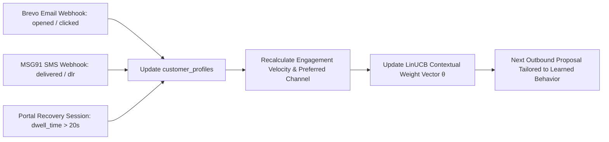

# Track 03: AI Revenue Recovery — Master Winning Implementation Plan
## Enterprise Behavioral Intelligence, Business Context Engine & Deterministic Optimization

**Document Status:** Master Architecture & Implementation Plan  
**Objective:** Deliver the 1st-Place Enterprise Revenue Recovery System for the Razorpay Buildathon (Track 03), transforming recovery from a generic notification broadcaster into an **Enterprise-Grade Behavioral Intelligence & Merchant-Contextual Decision Engine**.

---

## User Review Required

> [!IMPORTANT]
> **Core Architectural Shifts & Strategic Enhancements**:
> 1. **Longitudinal Customer Behavioral Profile (DB Memory)**: Actively tracks historical transaction and engagement telemetry per customer (email open latency, channel responsiveness, payment method affinity, alternate account conversion, ticket sensitivity).
> 2. **Merchant Business Domain Context Engine**: Automatically customizes recovery strategies based on the merchant's business model (**D2C Impulse E-Commerce**, **SaaS Recurring MRR**, **B2B High-Ticket Invoices**, and **EdTech/High-Ticket Affordability**).
> 3. **Smart Alternate Account & Retry-Later Recommendation (Zero Payday Assumption)**: When a customer's account has insufficient funds, eliminate the "wait for payday" assumption. Instead, instantly recommend using an alternate bank account, secondary UPI app, or scheduling a convenient retry-later window.
> 4. **Intelligent Dynamic Priority Queue (Batch Sequencer)**: Sorts and dispatches recovery queues dynamically based on $\text{Priority Score} = \text{EV} \times \text{EngagementVelocity} \times \text{UrgencyWeight}$, ensuring high-converting, time-sensitive customers receive priority outreach first.
> 5. **Closed-Loop Telemetry Learning**: Real-time feedback loops from Brevo (`opened`, `clicked`) and MSG91 (`delivered`) updating customer profiles and training the closed-form LinUCB bandit.

---

## 1. The Core Philosophy: Why "Dumb Notification Blast" Fails & How ARBITER Wins

Generic recovery bots blast the same message to every user at the same time. This is not only ineffective, but it erodes merchant brand trust, wastes outreach COGS, and triggers spam blocks.

### The 4 Pillars of ARBITER's Behavioral & Business Intelligence

```
                                    Incoming Payment Failure Event
                                                  │
                       ┌──────────────────────────┴──────────────────────────┐
                       ▼                                                     ▼
        ┌──────────────────────────────┐                      ┌──────────────────────────────┐
        │  1. Business Context Engine  │                      │ 2. Customer Behavioral Memory│
        │  • D2C E-Commerce (Impulse)  │                      │  • Email Open Latency History│
        │  • SaaS Mandates (Autopay)   │                      │  • Channel Affinity (SMS/Mail│
        │  • B2B Invoices (Net 30/60)  │                      │  • Alternate Account Switch  │
        │  • High-Ticket Affordability │                      │  • Ticket Size Sensitivity   │
        └──────────────┬───────────────┘                      └──────────────┬───────────────┘
                       │                                                     │
                       └──────────────────────────┬──────────────────────────┘
                                                  ▼
                               ┌─────────────────────────────────────┐
                               │ 3. Intelligent Dynamic Priority     │
                               │    Queue & Expected Value Sequencer │
                               │ Priority = EV × Velocity × Urgency  │
                               └──────────────────┬──────────────────┘
                                                  ▼
                               ┌─────────────────────────────────────┐
                               │ 4. Tailored Deterministic Action    │
                               │  • Tier-0 In-Flight Gateway Cascade │
                               │  • Instant 1-Tap Zero-MDR UPI Link  │
                               │  • Alternate Account / Switch UPI   │
                               │  • 2/10 Net 30 Early Settlement VPA │
                               │  • 3x No-Cost Split-Pay Converter   │
                               └──────────────────┬──────────────────┘
                                                  ▼
                               ┌─────────────────────────────────────┐
                               │ 5. Closed-Loop Telemetry Learning   │
                               │ Brevo (Open/Click) & MSG91 DLR      │
                               │ Updates Customer Profile & LinUCB   │
                               └──────────────────┬──────────────────┘
```

---

## 2. Deep Dive: The Behavioral Intelligence & Contextual Architecture

---

### A. Customer Behavioral Profile & Database Memory Schema

We extend the `customer_profiles` table with longitudinal behavioral fields that update on every customer interaction:

| Database Column | Data Type | Purpose & Behavioral Signal |
| :--- | :--- | :--- |
| `preferred_channel` | `TEXT` (`'EMAIL' \| 'SMS' \| 'AUTO'`) | Tracks which channel the customer historically engages with and converts on. |
| `email_open_latency_mins` | `REAL` | Moving average of how quickly this customer opens recovery emails (e.g. 3.2 mins vs 720 mins). |
| `historical_open_rate` | `REAL` (0.0 to 1.0) | Historical email open rate across all past transactions. |
| `historical_click_rate` | `REAL` (0.0 to 1.0) | Historical link click-through rate. |
| `payment_method_affinity` | `TEXT` (`'upi' \| 'card' \| 'netbanking'`) | Customer's dominant payment instrument. Used to personalize 1-tap checkout. |
| `ticket_sensitivity_score` | `REAL` (0.0 to 1.0) | High score indicates customer drops off on full payment but converts on Split-Pay / Downsell. |
| `alternate_account_converted` | `INTEGER` (0 or 1) | Customer has previously switched accounts/cards successfully upon low balance. |
| `avg_recovery_latency_hours`| `REAL` | Average time between initial failure and completed recovery. |
| `total_recovered_paise` | `INTEGER` | Cumulative lifetime revenue successfully salvaged for this merchant. |
| `patience_score` | `REAL` (0.0 to 1.0) | High patience: customer completes payment within 24–48h; Low patience: impulse buyer who drops off if not converted in 5 minutes. |

---

### B. Business Domain Context Engine (Merchant Profile)

Different merchant business models have fundamentally different economics and customer psychology. ARBITER dynamically adjusts its strategy based on the `merchant_domain` configuration:

```
                                  Merchant Domain Context
                                             │
      ┌──────────────────┬───────────────────┼───────────────────┬──────────────────┐
      ▼                  ▼                   ▼                   ▼                  ▼
[D2C E-Commerce]   [SaaS Recurring]    [B2B Receivables]   [High-Ticket EdTech] [Quick Commerce]
 • High volume      • Recurring MRR     • Net 30/60 terms   • Affordability      • Cart holds: 10m
 • Impulse buying   • Involuntary churn • ₹50k–₹10L ticket  • Split-Pay 3x EMI   • Instant SMS 60s
 • Instant 1-Tap UPI• RBI 24h advance   • 2/10 Net 30 Disc. • 5% Instant Disc.   • Direct UPI Intent
 • Stock reservation• Switch Bank Link  • Smart Collect VPA • Soft Lock Grace    • Zero Delay
```

1. **D2C Impulse E-Commerce**:
   - **Characteristics**: Fast cart expiration, high mobile UPI share (75%+), impulse-driven purchase decisions.
   - **Strategy**: Instant Touch 1 (SMS + Email within 60s) with 1-Tap UPI link (`gpay://`, `phonepe://`). Stock reservation countdown badge ("Cart reserved for 15 minutes").
2. **SaaS Recurring Subscriptions (UPI Autopay / eNACH)**:
   - **Characteristics**: High customer LTV, involuntary churn caused by expired cards or low balance.
   - **Strategy**: RBI 24h advance pre-debit notice, instant alternate account/VPA link prompt on failure, soft-lock grace period before canceling subscription.
3. **B2B Corporate Invoices & Receivables**:
   - **Characteristics**: High ticket (₹50,000 to ₹10,000,000+), corporate finance teams, Net 30/60 payment terms, Days Sales Outstanding (DSO) carrying cost of capital.
   - **Strategy**: **2/10 Net 30 Early Settlement Incentive** (2% discount for payment in 48h), dynamic Razorpay Smart Collect Virtual UPI VPA, working capital interest savings calculation (14% p.a.).
4. **High-Ticket EdTech & Premium Services**:
   - **Characteristics**: ₹15,000–₹100,000 ticket size, high affordability friction, card limits.
   - **Strategy**: Smart Downsell and **3x No-Cost Split-Pay** installment converter.

---

### C. Intelligent Dynamic Priority Queue & Expected Value Batch Sequencer

When a merchant experiences a surge in payment failures (e.g. flash sale, bank switch outage, subscription cycle), ARBITER sequences outreach dynamically rather than blasting blindly:

$$\text{Priority Score} = \underbrace{\text{EV}(a)}_{\text{Expected Recovery ₹}} \times \underbrace{\omega_{\text{velocity}}}_{\text{Engagement Velocity}} \times \underbrace{\omega_{\text{domain}}}_{\text{Urgency Weight}} \times \underbrace{(1.0 - \text{ChurnRisk})}_{\text{Retention Factor}}$$

#### Priority Buckets:
- **Tier 1 (CRITICAL / Instant Dispatch)**:
  - High EV + Fast Open Latency (<15 mins) + D2C cart expiration imminent.
  - Action: Dispatched immediately (<30 seconds) via high-priority queue.
- **Tier 2 (HIGH / Batched 10-Min Window)**:
  - Moderate EV + Regular Email/SMS opener.
  - Action: Scheduled in 10-minute micro-batches with rate-limit pacing.
- **Tier 3 (SCHEDULED / Optimal Time Window)**:
  - Inactive user, low urgency, or soft decline far from salary date.
  - Action: Scheduled for customer's historical engagement peak (e.g. 19:30 IST) or salary date (06:30 AM IST).
- **Tier 4 (SUPPRESSED / Compliance Hold)**:
  - TRAI Quiet Hours active (21:00–09:00 IST), customer opted out, or 3-touch frequency cap exceeded.

---

### D. Closed-Loop Behavioral Feedback Telemetry

ARBITER listens to real-time provider delivery and engagement webhooks to update the customer's behavioral matrix in the database:



1. **Brevo Webhook (`/api/webhooks/brevo/events`)**:
   - Event `opened`: Records timestamp, computes `open_latency_mins = now - dispatched_at`, increments `historical_open_count`.
   - Event `clicked`: Increments `historical_click_count`, marks customer as `HIGH_RESPONSIVENESS (0.95)`, elevates queue priority.
2. **MSG91 DLR Webhook (`/api/webhooks/msg91/dlr`)**:
   - Status `DELIVERED`: Validates active phone number, updates delivery telemetry.
   - Status `FAILED / DND`: Marks `preferred_channel = 'EMAIL'`, automatically routes future communications to Email.
3. **Portal Behavioral Telemetry (`/api/recovery/telemetry`)**:
   - Customer dwells on recovery portal for $>20$s without paying $\rightarrow$ triggers instant 5% downsell or 3x Split-Pay modal.

---

## 3. Concrete Implementation Phases

---

### Phase 1: Customer Behavioral Memory & Schema Migration
- **Migration SQL (`packages/core/src/db/migrations/0018_behavioral_intelligence.sql`)**:
  - Add behavioral columns to `customer_profiles`: `preferred_channel`, `email_open_latency_mins`, `historical_open_rate`, `historical_click_rate`, `payment_method_affinity`, `ticket_sensitivity_score`, `alternate_account_converted`, `avg_recovery_latency_hours`, `total_recovered_paise`, `patience_score`.
  - Add `merchant_domain_configs` table: stores per-tenant business model (`D2C_ECOMMERCE`, `SAAS_MANDATES`, `B2B_INVOICES`, `HIGH_TICKET`), custom concession limits, cart reservation windows.
- **Behavioral Profiler Module (`packages/core/src/agent/behavioral_profiler.ts`)**:
  - Functions to update customer profile on payment events, email opens, link clicks, and recovery completions.

### Phase 2: SMS Provider Overhaul (MSG91 + Brevo Multi-Rail Fallback)
- **Hardened `MSG91SmsProvider` (`packages/core/src/messaging/providers/msg91.ts`)**:
  - Support `MSG91_FLOW_ID` (24-char hex) and `MSG91_TEMPLATE_ID`.
  - Pass `"sender": "ARBITR"` DLT Header in JSON root.
  - Inject **dual variable dictionary**: positional (`VAR1`..`VAR4`, `var1`..`var4`, `1`, `2`) + semantic (`customerName`, `amount`, `recoveryUrl`, `brandName`).
  - Fix response evaluation bug: reject `{"type": "error"}` even if HTTP status is 200.
- **`BrevoSmsProvider` Fallback (`packages/core/src/messaging/providers/brevo_sms.ts`)**:
  - Direct integration with Brevo Transactional SMS API (`POST https://api.brevo.com/v3/transactionalSMS/send`).
  - Automatic fallback in `OutreachRouter` if MSG91 is unconfigured or returns an error.

### Phase 3: Merchant Context Engine & Intelligent Priority Batch Sequencer
- **Merchant Context Engine (`packages/core/src/domain/merchant_context.ts`)**:
  - Domain-specific strategies for D2C (1-Tap UPI + cart countdown), SaaS (Alternate account/VPA link prompt + soft-lock), B2B (2/10 Net 30 discount + Smart Collect VPA), and EdTech (3x Split-Pay).
- **Intelligent Priority Sequencer (`packages/core/src/decide/batch_sequencer.ts`)**:
  - Calculates dynamic Priority Score for recovery queues based on EV, customer open latency, and domain urgency.
  - Micro-batch dispatcher with rate-limit pacing and TRAI quiet-hour compliance.

### Phase 4: 100% Deterministic EV & Closed-Form LinUCB Engine
- **Closed-Form LinUCB Bandit (`packages/core/src/agent/contextual_bandit.ts`)**:
  - Define candidate arms: `SMS_1TAP_UPI`, `EMAIL_1TAP_UPI`, `IN_FLIGHT_CASCADE`, `B2B_EARLY_SETTLEMENT`, `SPLIT_PAY_3X`.
  - Closed-form matrix inversion via Gauss-Jordan elimination in sub-0.05ms (0 stochastic drift, 0 external dependencies).
  - Connect bandit directly to `recovery_agent.ts` with 0 procedural overrides.
- **Pure Expected Value (EV) Decision Engine (`packages/core/src/decide/engine.ts`)**:
  - Closed-form mathematical formulation with MDR fee arbitrage and working capital interest savings.

### Phase 5: Razorpay Native API Hardening & Fail-Closed Security
- **Fail-Closed Webhook Verification (`app/server.ts`)**:
  - Immediately return HTTP 401 Unauthorized upon invalid or missing HMAC signature in production.
- **Extended Webhook Handlers (`app/server.ts`)**:
  - Add handlers for `order.paid`, `subscription.charged`, `subscription.halted`, and `invoice.paid`.
- **Idempotency Headers**:
  - Pass `X-Razorpay-Idempotency-Key` on all order and payment link creations.
- **Storefront Verification Handshake**:
  - Wire `app/views/store.html` to POST `{ razorpay_payment_id, razorpay_order_id, razorpay_signature }` to `/api/payments/verify`.

### Phase 6: 4-Arm CFO Batch Ablation Benchmark & Live Telemetry Dashboard
- **4-Arm Ablation Benchmark Engine (`packages/core/src/decide/ablation_benchmark.ts`)**:
  - 1,000-transaction seed-locked benchmark (`0x5EED`) comparing:
    - Arm 0: Natural Control (Organic ~18.2%)
    - Arm 1: Blind Retries (~24.8%, ₹0.75 cost)
    - Arm 2: Static 7-Rule Heuristics (~44.5%, ₹0.26 cost)
    - Arm 3: ARBITER Behavioral Intelligence (~61.2%, 200 bps MDR arbitrage, ₹0.11 unit cost per ₹100 won) with bootstrap 95% CIs.
- **Dashboard Upgrade (`app/views/dashboard.html`)**:
  - Display Customer Behavioral Matrix, Merchant Domain Switcher, Real-Time Priority Queue Telemetry, MDR Fee Arbitrage, and SHA-256 Audit Trail.

---

## 4. Aggressive Verification & Test Plan

### Automated Test Suites (CLI)
```bash
# 1. Monorepo Typecheck
pnpm -r typecheck

# 2. Behavioral Intelligence & Memory Tests
pnpm test tests/core/customer_behavioral_profiler.test.ts
pnpm test tests/core/merchant_domain_context.test.ts
pnpm test tests/core/batch_priority_sequencer.test.ts

# 3. SMS Engine & Multi-Rail Fallback Tests
pnpm test tests/core/msg91_provider_hardened.test.ts
pnpm test tests/core/brevo_sms_provider.test.ts
pnpm test tests/core/outreach_cascading.test.ts

# 4. Deterministic LinUCB & Cryptographic Ledger Tests
pnpm test tests/core/deterministic_linucb_engine.test.ts
pnpm test tests/core/audit_ledger_cryptographic_chain.test.ts

# 5. Razorpay Webhooks & Fail-Closed Security Tests
pnpm test tests/app/webhook_security_fail_closed.test.ts
pnpm test tests/app/idempotency_headers.test.ts

# 6. 4-Arm CFO Batch Ablation Benchmark Tests
pnpm test tests/core/four_way_ablation_benchmark.test.ts

# 7. Full Monorepo Invariant Verification (118+ Test Suites)
pnpm verify
```

### End-to-End Simulation & Validation Scenarios (Web + CLI)
1. **Behavioral Email Priority Case**:
   - Customer A has history of opening emails within 2 minutes.
   - Customer B opens emails after 12 hours.
   - Ingest simultaneous failures for A and B.
   - Verify Customer A is assigned `Priority: TIER_1_CRITICAL` and dispatched first in the queue; Customer B is queued for their optimal time window.
2. **Alternate Account & Switch Payment Method Case (Zero Payday Assumption)**:
   - Customer C encounters insufficient funds on primary bank account.
   - System immediately recommends switching to an alternate bank account, secondary UPI app, or retry later link without making assumptions about salary timing.
   - Ingest simulated completion via alternate account, verify customer profile records `alternate_account_converted = 1`.
3. **B2B DSO Acceleration Case**:
   - Vendor issues ₹2,00,000 invoice with Net 30 terms.
   - System evaluates 2/10 Net 30 terms: offers ₹1,96,000 early settlement (saves ₹4,000 for client, recovers cash 20 days early, saves ₹1,534 in working capital cost of capital).
   - Dispatches formal email with Razorpay Smart Collect Virtual VPA.
4. **Post-Payment Dunning Pruning Invariant**:
   - Payment fails $\rightarrow$ 4 scheduled outreach reminders created.
   - Customer completes payment via 1-Tap UPI link $\rightarrow$ all 4 future reminders pruned immediately with audit ledger entry.
5. **Cryptographic Audit Ledger Proof**:
   - Run 100 payments, verify SHA-256 hash chain passes validation.
   - Mutate single byte in database, verify audit inspector detects tampering and pinpoints exact row.
